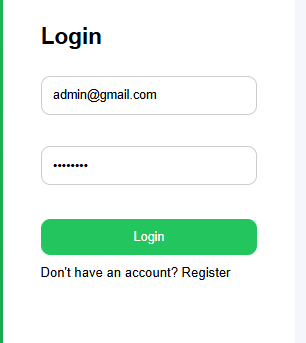
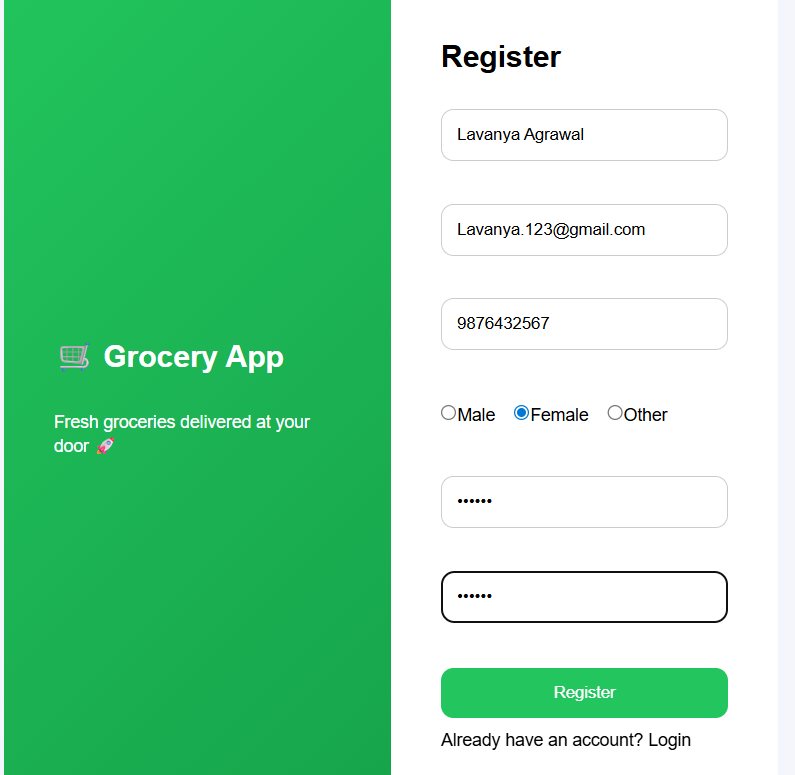
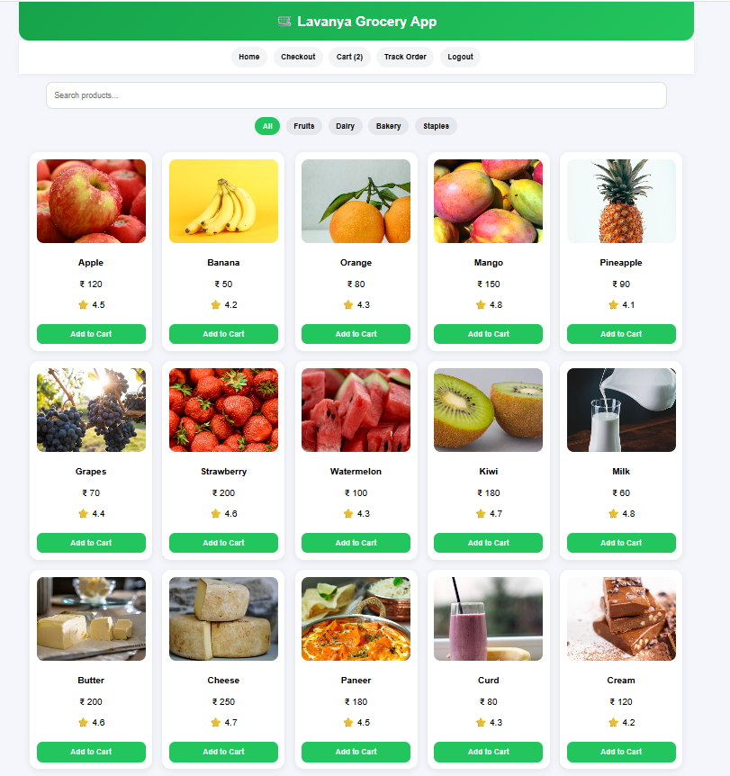
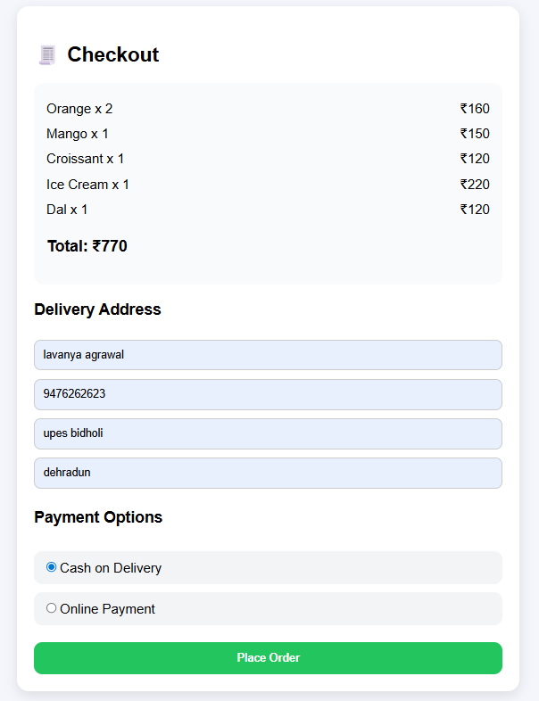
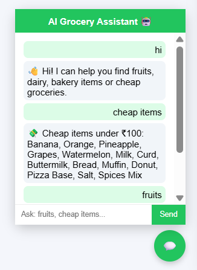
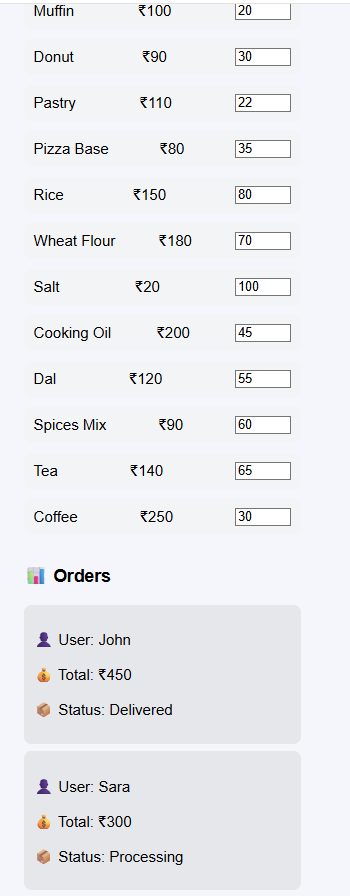
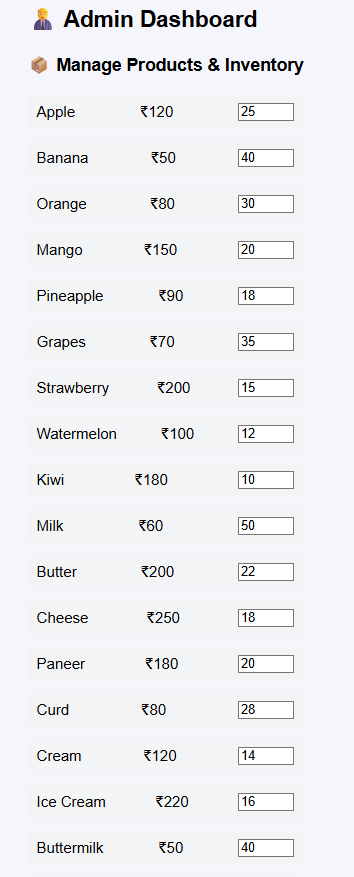

# 🛒 Smart Grocery App

A modern grocery shopping web application built using **React.js**. The application allows users to browse products, manage their shopping cart, track orders, interact with a chatbot, and provides an admin dashboard for management purposes.

---

## 🚀 Features

- 🔐 User Login & Registration
- 🛍️ Grocery Product Listing
- 🛒 Shopping Cart Management
- 📦 Order Tracking
- 🤖 Chatbot Support
- 👨‍💼 Admin Dashboard
- 📱 Responsive User Interface
- ⚡ Fast and Interactive Experience

---

## 🛠️ Tech Stack

- React.js
- JavaScript (ES6+)
- HTML5
- CSS3
- React Context API

---

## 📂 Project Structure

```text
smart-grocery-app/
├── public/
├── src/
│   ├── Screenshots/
│   ├── components/
│   ├── context/
│   ├── pages/
│   ├── App.js
│   ├── App.css
│   ├── data.js
│   ├── index.js
│   ├── index.css
│   ├── logo.svg
│   ├── reportWebVitals.js
│   └── setupTests.js
├── package.json
├── package-lock.json
├── .gitignore
└── README.md
```

---

## 📸 Screenshots

### Login Page


### Registration Page


### User Dashboard


### Shopping Cart


### Order Tracking


### Chatbot Assistant


### Admin Login


### Admin Dashboard


---

## ⚙️ Installation

### Clone the Repository

```bash
git clone https://github.com/lavanyaag23/smart-grocery-app.git
```

### Navigate to Project Directory

```bash
cd smart-grocery-app
```

### Install Dependencies

```bash
npm install
```

### Start the Development Server

```bash
npm start
```

The application will run on:

```text
http://localhost:3000
```

---

## 🎯 Key Learning Outcomes

- React Components
- State Management
- React Context API
- Routing & Navigation
- Responsive Design
- Shopping Cart Functionality
- Component-Based Architecture
- Frontend Development Best Practices

---

## 🔮 Future Enhancements

- Payment Gateway Integration
- Product Search & Filtering
- Wishlist Feature
- User Profile Management
- Backend Database Integration
- Real-Time Notifications
- Dark Mode Support

---

## 👩‍💻 Author

**Lavanya Agrawal**

B.Tech Computer Science Engineering  
UPES, Dehradun

GitHub: https://github.com/lavanyaag23

---

⭐ If you found this project useful, consider giving it a star!
